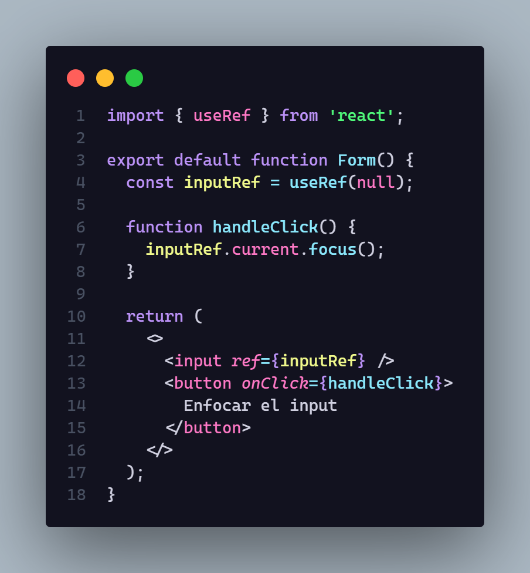
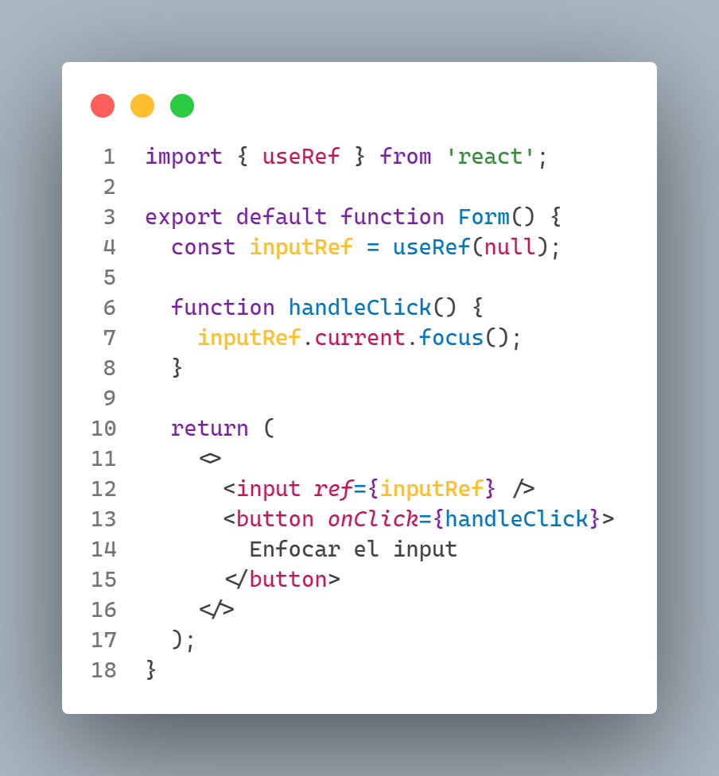
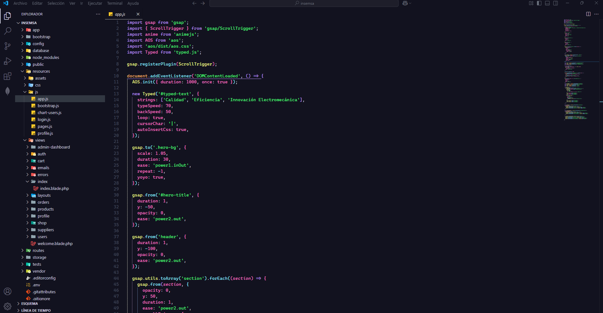

# Nebula Symphony

[Nebula Symphony on VS Code Marketplace](https://marketplace.visualstudio.com/items?itemName=Keevdev.nebula-symphony)

Nebula Symphony is a collection of Visual Studio Code themes inspired by the aesthetics of space and visual symphony.

## Included Themes
- **Nebula Symphony Dark**
- **Nebula Symphony Light**

## Screenshots

  
  
  

## Installation
1. Open Visual Studio Code.
2. Search for **Nebula Symphony** in the Extensions tab.
3. Install and select the theme from `Preferences > Color Theme`.

Enjoy coding with style!
